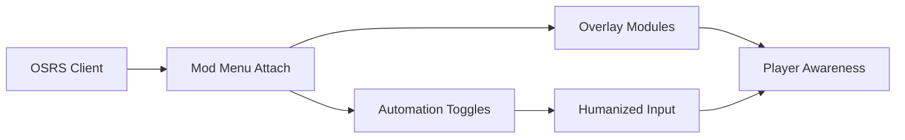

## OSRS Mod Menu — A Gentle Hand on an Ancient World

There is a hush that lives inside **Old School RuneScape**. A rhythm measured in ticks, patience, and repetition. This **OSRS Mod Menu** does not shatter that silence—it **organizes it**, like a well-worn journal filled with shortcuts only you can read.

One menu.
Many paths.
All taken at your pace.

---

## 🧭 Overview — One Panel, Endless Possibilities

The mod menu is a centralized control hub, bringing together overlays, skilling helpers, and automation modules into a **single, clean interface**. No tab-hopping. No scattered scripts. Just clarity—layered gently over the familiar world of Gielinor.

Everything is toggle-based. Nothing is forced.

---

## 🎛 Core Mod Menu Features

Think of it as a dashboard rather than a weapon.

* One-click enable/disable for all modules
* Real-time sliders and numeric inputs
* Hotkey binding for quick control
* Profile-based configuration saving
* Minimal UI that blends with OSRS visuals

The menu stays out of the way—until you call it.

---

## 👁 Visual Overlays & World Clarity

Seeing clearly turns wandering into intention.

* NPC and monster highlights
* Resource node overlays
* Ground item labels with value filters
* Interactive object outlines
* Tile and distance indicators

Overlays are modular—enable only what serves your current task.

---

## ⚙️ Skilling & Automation Toggles

The grind becomes softer when repetition is guided.

* Auto-click helpers (tick-aware)
* Skill-specific modules (fishing, woodcutting, mining, agility)
* Bank interaction logic
* Inventory rules & cleanup
* AFK-friendly idle handling

Each toggle can be activated independently, allowing hybrid playstyles.

> [!IMPORTANT]
> Conservative settings and regular breaks are strongly recommended to protect account longevity.

---

## ⚔️ PvM & Utility Tools

For moments when danger interrupts routine:

* Prayer assist & flick timing hints
* NPC attack cycle indicators
* Auto-eat thresholds
* Safe-spot visualization
* Boss mechanic alerts

No invulnerability—just information, calmly presented.

---

## 🧠 Profiles, Presets & Flow

Every session has its own mood.

* Skill-based presets
* Time-limited sessions
* Randomized break scheduler
* Easy profile switching
* Import/export configs

Morning skilling feels different from late-night farming—and the menu adapts.

---

## ⚡ Setup — Familiar as Opening a Bank

1. Launch the OSRS client and log in
2. Run the Mod Menu software as Administrator
3. Attach to the client
4. Open the menu via hotkey
5. Toggle modules as needed

Example menu config:

```ini
[Menu]
ToggleKey = Insert

[Overlay]
NPCs = true
GroundItems = true
Tiles = false

[Automation]
AutoClick = true
Breaks = true
```

Simple switches. Thoughtful control.

---

## 🧭 Mod Menu Flow (Mermaid)



Each module breathes independently—keeping the experience light and stable.

---

## ❓ FAQ — Old Paths, New Tools

**Is this safer than standalone bots?**
Generally yes. Modular toggles reduce constant automation.

**Can I use it manually only?**
Absolutely. Many players use overlays without automation.

**Does it support Ironman accounts?**
Technically yes, but caution is advised.

**Can I customize everything?**
Nearly every value—timing, visuals, behavior—is adjustable.

**Is it beginner-friendly?**
Default presets are conservative and easy to understand.

---

## 🌿 Final Thoughts — Order in the Long Journey

OSRS has always been about endurance, not speed. This **OSRS Mod Menu** doesn’t rush that journey—it **organizes it**, giving you calm control over long sessions and repetitive paths.

The world remains the same.
The grind still hums.
But now—your hands rest lighter on the mouse.
